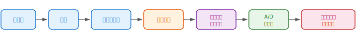
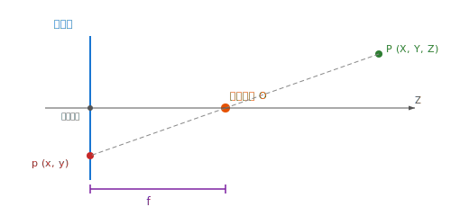
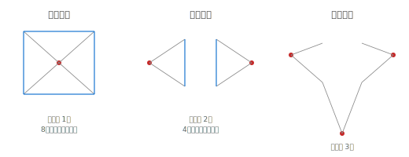
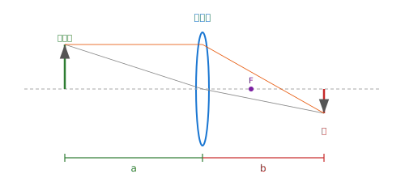
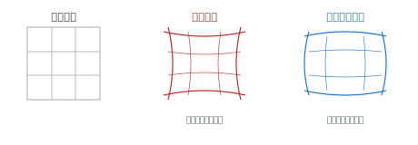
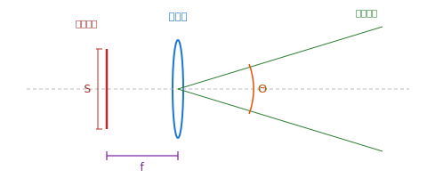
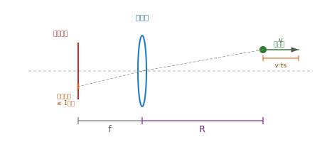
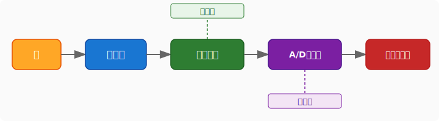
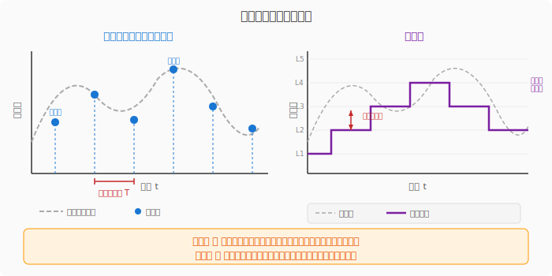
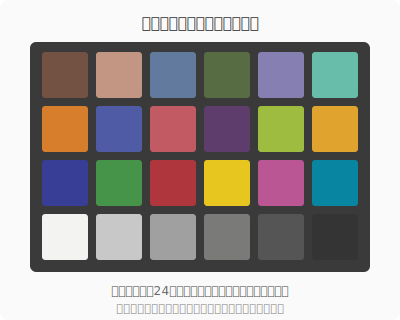

# 第2章　ディジタルカメラの構成

---

## 2-1　ディジタルカメラの構成

### 基本機能

ディジタルカメラは、**光をディジタルデータに変換する**装置である。

$$
\text{光} \rightarrow \text{撮像素子} \rightarrow \text{電気信号} \rightarrow \text{ディジタルデータ}
$$

### 構成要素

ディジタルカメラは以下の構成要素からなる：

$$
\text{レンズ} \rightarrow \text{絞り} \rightarrow \text{シャッター} \rightarrow \text{撮像素子} \rightarrow \text{アナログ信号処理} \rightarrow \text{A/D変換器} \rightarrow \text{ディジタル信号処理}
$$

| 構成要素 | 役割 |
|---------|------|
| **レンズ** | 光を集めて撮像素子に結像させる |
| **絞り** | 光量を調整する（F値で制御） |
| **シャッター** | 露光時間を制御する |
| **撮像素子** | 光を電気信号に変換する（CCD / CMOS） |
| **アナログ信号処理** | ノイズ除去・増幅などのアナログ処理 |
| **A/D変換器** | アナログ信号をディジタル信号に変換する |
| **ディジタル信号処理** | ホワイトバランス・ガンマ補正・圧縮等 |

---

## 2-2　画像生成の幾何学的モデル

### 2-2-1　ピンホールカメラモデル

#### 概要

ピンホールカメラとは、小さな穴（ピンホール）を開けた暗箱の内側に、外界の風景が**上下左右反転して**映るカメラである。

#### 主要な要素

| 用語 | 説明 |
|------|------|
| **光学中心（投影中心）** | ピンホール（レンズ中心）の位置 |
| **投影面（画像面）** | 像が結ばれるセンサー面 |
| **焦点距離** $f$ | 光学中心から投影面までの距離 |
| **光軸** | 光学中心を通り投影面に垂直な軸 |
| **画像中心** | 光軸と投影面の交点 |

#### 透視投影の基本式

3次元空間の点 $(X, Y, Z)$ がピンホールカメラによって画像面上の点 $(x, y)$ に投影されるとき、相似の関係から以下が成り立つ：

$$
x = f \cdot \frac{X}{Z}, \quad y = f \cdot \frac{Y}{Z}
$$

ここで：
- $(X, Y, Z)$：3次元空間中の物体の座標（カメラ座標系）
- $(x, y)$：画像面上の投影座標
- $f$：焦点距離
- $Z$：物体の奥行き（光軸方向の距離）

> **注意**：$Z$ が大きいほど投影像は小さくなる。これが遠近感（パースペクティブ）の原理である。

---

### 2-2-2　透視投影モデル

#### 消失点定理

3次元空間において**互いに平行な直線群**は、透視投影において画像面上の**1点（消失点）**に収束する。

ただし、投影面と平行な直線は画像面上でも平行のままであり、消失点を持たない。

#### 消失点の数と透視図の分類

直方体（12辺、3方向×各4辺）を投影する場合：

| 条件 | 消失点の数 | 名称 |
|------|-----------|------|
| 3方向の辺がすべて投影面と**非平行** | **3つ** | 三点透視 |
| 1方向の4辺が投影面と**平行** | **2つ** | 二点透視 |
| 2方向の8辺が投影面と**平行** | **1つ** | 一点透視 |

#### 消失点の求め方

方向ベクトル $\mathbf{d} = (d_x, d_y, d_z)^T$ を持つ平行な直線群の消失点 $(v_x, v_y)$ は：

$$
v_x = f \cdot \frac{d_x}{d_z}, \quad v_y = f \cdot \frac{d_y}{d_z}
$$

> **注意**：$d_z = 0$ の場合（投影面と平行な直線）は消失点が無限遠に位置する、すなわち消失点は存在しない。

---

### 2-2-3　レンズモデル

#### 1. 薄肉レンズ

薄肉レンズとは、レンズの厚みが焦点距離に比べて十分小さく、**厚みを無視できる**レンズモデルである。

##### レンズの結像公式（薄肉レンズの式）

$$
\frac{1}{a} + \frac{1}{b} = \frac{1}{f}
$$

ここで：
- $a$：被写体からレンズ中心までの距離（ワーキングディスタンス, WD）
- $b$：レンズ中心から投影面（センサー）までの距離
- $f$：焦点距離

##### 倍率

結像の倍率 $m$ は次式で与えられる：

$$
m = \frac{b}{a}
$$

> **注意**：$a \to \infty$（無限遠）のとき $b \to f$ となり、ピンホールカメラモデルと等価になる。

---

#### 2. 厚肉レンズ

厚肉レンズとは、レンズの厚みが**無視できない**レンズモデルである。

複数のレンズ群で構成される実際のカメラレンズでは、薄肉レンズの近似が成り立たない。この場合、**主平面**（前側主平面 $H$、後側主平面 $H'$）を導入して扱う。

##### 厚肉レンズの結像公式

$$
\frac{1}{a'} + \frac{1}{b'} = \frac{1}{f}
$$

ここで：
- $a'$：被写体から**前側主平面** $H$ までの距離
- $b'$：**後側主平面** $H'$ からセンサーまでの距離

##### ノーダルポイント回転

厚肉レンズにおいて、レンズ系の**後側ノーダルポイント（節点）**を中心にカメラを回転（パン方向）させると、投影中心の位置が変化しないため、パノラマ撮影時に視差（パララックス）が生じない。

---

#### 3. 歪曲収差（ディストーション）

実際のレンズでは、理想的な透視投影からのずれ（歪み）が生じる。これを**歪曲収差**という。

##### 歪曲収差の種類

| 種類 | 特徴 |
|------|------|
| **樽型歪曲（バレル型）** | 画像の周辺が外側に膨らむ。広角レンズで顕著 |
| **糸巻き型歪曲（ピンクッション型）** | 画像の周辺が内側に縮む。望遠レンズで顕著 |

##### 歪曲収差の分類

- **半径方向（ラディアル）歪曲**：レンズの中心から放射状に生じる歪み
- **接線方向（タンジェンシャル）歪曲**：レンズ要素の偏心により生じる歪み

##### 歪曲収差モデル（完全モデル）

歪曲のない理想座標を $(x_u, y_u)$、歪曲後の実際の座標を $(x_d, y_d)$ とすると：

**半径方向歪曲：**

$$
x_d = x_u \left(1 + k_1 r^2 + k_2 r^4 + k_3 r^6 \right)
$$

$$
y_d = y_u \left(1 + k_1 r^2 + k_2 r^4 + k_3 r^6 \right)
$$

**接線方向歪曲：**

$$
\Delta x = 2p_1 x_u y_u + p_2 (r^2 + 2x_u^2)
$$

$$
\Delta y = p_1 (r^2 + 2y_u^2) + 2p_2 x_u y_u
$$

**総合歪曲モデル：**

$$
x_d = x_u (1 + k_1 r^2 + k_2 r^4 + k_3 r^6) + 2p_1 x_u y_u + p_2 (r^2 + 2x_u^2)
$$

$$
y_d = y_u (1 + k_1 r^2 + k_2 r^4 + k_3 r^6) + p_1 (r^2 + 2y_u^2) + 2p_2 x_u y_u
$$

ここで：

$$
r^2 = x_u^2 + y_u^2
$$

| 記号 | 意味 |
|------|------|
| $(x_d, y_d)$ | 歪曲**あり**の画像座標 |
| $(x_u, y_u)$ | 歪曲**なし**の理想画像座標 |
| $r$ | 画像中心から $(x_u, y_u)$ までの距離 |
| $k_1, k_2, k_3$ | 半径方向歪曲係数 |
| $p_1, p_2$ | 接線方向歪曲係数 |

##### 簡略歪曲モデル

接線方向歪曲を無視し、半径方向歪曲のみを考慮する場合：

$$
x_d = (1 + k_1 r^2 + k_2 r^4) \, x_u
$$

$$
y_d = (1 + k_1 r^2 + k_2 r^4) \, y_u
$$

> **補足**：多くの実用では $k_1$ のみで十分な精度が得られることが多い。

---

#### 4. 周辺光量の低下（ビネッティング）

画像の周辺部が中心部に比べて暗くなる現象を**周辺光量の低下（ビネッティング）**という。主な原因は2つある。

##### (a) 口径食（けられ）

レンズ鏡筒やフードなどにより、斜めに入射する光束の一部が**遮断される**現象。

- **絞り（F値）を大きくする**ことで改善できる
- 絞り開放時に顕著

##### (b) コサイン4乗則

光軸からの角度 $\theta$ の方向から入射する光の照度は、中心照度に対して $\cos^4\theta$ に比例して低下する。

$$
E(\theta) = E_0 \cos^4\theta
$$

- F値の調整では改善**できない**（光学的な原理による）
- 対策：レトロフォーカス型レンズ（広角レンズ）のように、射出瞳を大きく設計してより多くの光線を取り込む工夫をする

---

## 2-3　撮像パラメータ

### 2-3-1　撮像画角

#### 画角とは

画角とは、カメラが撮影できる範囲を角度で表したものである。レンズの焦点距離と撮像素子のサイズによって決まる。

#### 画角の計算式

$$
\Theta = 2 \arctan \frac{S}{2f}
$$

ここで：
- $\Theta$：画角
- $S$ [mm]：撮像素子サイズ（水平方向なら幅、垂直方向なら高さ）
- $f$ [mm]：レンズの焦点距離

> **補足**：水平方向の $S$ を用いれば**水平画角**、垂直方向の $S$ を用いれば**垂直画角**が求まる。

#### 画角に影響する要因

##### 1. 撮像素子サイズ

撮像素子が大きいほど画角は広くなる。代表的な撮像素子サイズを以下に示す。

| 名称 | サイズ（幅×高さ） |
|------|-------------------|
| **フルサイズ**（35mmフィルム相当） | 36.0 × 24.0 mm |
| **APS-C** | 23.6 × 15.8 mm |
| **マイクロフォーサーズ** | 17.3 × 13.0 mm |
| **1型** | 13.2 × 8.8 mm |
| **1/1.8型** | 7.2 × 5.3 mm |
| **1/2型** | 6.4 × 4.8 mm |
| **1/3型** | 4.8 × 3.6 mm |

##### 2. レンズ焦点距離

焦点距離が短いほど画角は広く、長いほど画角は狭くなる。**35mmフィルム換算焦点距離**を基準とした分類：

| 分類 | 35mm換算焦点距離 | 特徴 |
|------|-----------------|------|
| **広角レンズ** | 約 50mm **未満** | 広い範囲を撮影できる |
| **標準レンズ** | 約 50mm | 人間の視野に近い |
| **望遠レンズ** | 約 50mm **超** | 遠くの被写体を拡大できる |

##### 3. 撮像素子とレンズの組み合わせ

撮像素子サイズとレンズ焦点距離を適切に組み合わせることで、同じ撮像画角を実現することもできる。

---

### 2-3-2　画像の明るさ

画像の明るさは、**レンズ絞り**、**シャッタースピード**、**ISO感度**の3要素で制御される。

#### 1. レンズ絞り（F値）

絞りとは、レンズを通過する光の量を調整する機構である。F値（絞り値）は以下で定義される：

$$
F = \frac{f}{D}
$$

ここで：
- $F$：F値（絞り値）
- $f$：焦点距離
- $D$：有効口径（レンズの有効開口径）

撮像素子に到達する光の強度 $I$ は：

$$
I \propto \left(\frac{D}{f}\right)^2 = \frac{1}{F^2}
$$

> **補足**：F値が小さいほど光量が多く明るい画像が得られるが、被写界深度は浅くなる。

#### 2. シャッタースピード（露光時間）

シャッタースピードとは、撮像素子が光にさらされる時間（露光時間）である。

- 露光時間が**長い**ほど光量が増え、明るい画像が得られる
- 露光時間が**短い**ほど光量が減り、暗い画像になるが、動きのある被写体を鮮明に撮れる

| 条件 | 光量 | 動体撮影 |
|------|------|----------|
| シャッタースピード速い（短い露光） | 少ない | 鮮明 |
| シャッタースピード遅い（長い露光） | 多い | ブレやすい |

#### 3. ISO感度

ISO感度とは、撮像素子の光に対する感度を示す値である。

- 感度が**高い**ほど、少ない光量で明るい画像が得られる
- ただし、感度を上げるほど**ノイズが増加**する
- 感度と露光時間を組み合わせて調整することで、適切な光量を得る

#### 4. ブレのない画像の撮影

移動する被写体を撮影する際、像のブレが1画素以内に収まる条件を求める。

被写体の移動によるブレが1画素分に相当する条件は：

$$
\frac{v \cdot t_s}{R} = \frac{S}{f \cdot N}
$$

ここで：
- $v$ [m/s]：被写体の移動速度
- $t_s$ [s]：シャッタースピード（露光時間）
- $R$ [m]：被写体までの距離
- $f$：レンズの焦点距離
- $N$：撮像素子の画素数（移動方向）
- $S$：撮像素子サイズ（移動方向）

これを $t_s$ について解くと：

$$
t_s \leq \frac{R \cdot S}{v \cdot f \cdot N}
$$

> **補足**：ブレのない画像を得るには、シャッタースピードを上記の値以下にする必要がある。

---

### 2-3-3　被写界深度

#### 定義

被写界深度とは、**遠点から近点まで**の、実用上ピントが合っていると判断できる距離範囲のことである。

#### 被写界深度の特性

| 条件 | 被写界深度 |
|------|-----------|
| 前側と後側の比較 | **後側**被写界深度の方が深い |
| 絞り値が同じ場合 | 焦点距離が**短い**ほど深く、**長い**ほど浅い |
| 焦点距離が同じ場合 | 絞り値（F値）が**大きい**ほど深く、**小さい**ほど浅い |
| レンズ条件が同じ場合 | 被写体距離が**遠い**ほど深く、**近い**ほど浅い |

#### 実用上のトレードオフ

奥行きのあるワーク（被写体）に対し、ボケなく撮像するにはF値を大きく設定する必要があるが、画像が暗くなるため、長いシャッタースピード（露光時間）にしなければならない。しかし、シャッタースピードを遅くすると移動ブレが発生する可能性があるため、被写界深度を深くする場合にも**強力な照明**を用いる必要がある。

---

### 2-3-4　フレームレート

#### 定義

フレームレートとは、1秒あたりに切り替えて表示する画像枚数のことである。単位は **fps**（frames per second）で表される。

#### フリッカ現象

**フリッカ（flicker）現象**とは、照明光の明滅周期とカメラのフレームレート（シャッタースピード）が一致しない場合に、画像の明るさがフレームごとにちらつく現象である。

- **原因**：交流電源による照明（蛍光灯など）は電源周波数の2倍で明滅する（50Hz地域 → 100Hz、60Hz地域 → 120Hz）
- **対策**：シャッタースピードを光の明滅周期の整数倍に設定する

> **例**：100Hzで明滅する照明の場合、シャッタースピードを $\frac{1}{100}$ 秒（またはその整数倍）に設定すれば、フリッカは発生しない。

---

## 2-4　画像のデジタル化

### 2-4-1　グレースケール画像

#### 画素（ピクセル）

**画素（pixel）** とは、ディジタル画像を構成する最小単位の点である。ディジタル画像は、2次元格子状に配列された画素の集合として表現される。

#### 画素値

**画素値**とは、各画素に割り当てられた明るさの数値である。グレースケール画像では、通常 $0$（黒）〜 $255$（白）の整数値で表される。

##### 画像データサイズ

8ビットのグレースケール画像の場合、画像データのサイズは以下のように計算される：

$$
\text{画像サイズ [byte]} = \text{画素数} \times 1 \text{ [byte]}
$$

> **補足**：1画素あたり8ビット（= 1バイト）で表現されるため、例えば $640 \times 480$ 画素の画像は $640 \times 480 = 307{,}200$ バイト（約300KB）となる。

#### プロファイル

**プロファイル**とは、画像のある走査線（水平ライン）に沿って画素値を読み取り、横軸を水平位置、縦軸を画素値としてプロットしたグラフである。画像の明暗変化やエッジの有無を視覚的に確認するために用いる。

---

### 2-4-2　標本化と量子化

#### 標本化（サンプリング）

**標本化**とは、空間的に連続なアナログ信号から、離散的な位置におけるアナログ値を取り出す処理のことである。

| 用語 | 説明 |
|------|------|
| **標本点** | 信号値を取得する離散的な位置（画素の位置に相当） |
| **標本化間隔** | 隣接する標本点間の距離（画素ピッチに相当） |
| **標本値** | 各標本点で取得されたアナログ信号の値 |

#### 量子化

**量子化**とは、標本値（連続的なアナログ値）を有限分解能の離散的な数値に変換する処理のことである。

| 用語 | 説明 |
|------|------|
| **8ビット量子化** | $2^8 = 256$ 段階の値に変換する。最も一般的な量子化 |
| **量子化レベル数** | 量子化後の離散値の段階数（= 階調数）。8ビットなら256階調 |
| **量子化誤差** | 元のアナログ値と量子化後の離散値との差。丸め誤差に相当する |

#### 画像のディジタル化パイプライン

画像のディジタル化は、以下のパイプラインで行われる。撮像素子で**標本化**が、A/D変換器で**量子化**がそれぞれ実行される。

#### 標本化と量子化の概念図

---

#### 標本化定理（シャノンの標本化定理）

##### 定理の内容

アナログ信号が周波数 $f_{\max}$ に帯域制限されているとき、**$2f_{\max}$ 以上の標本化周波数**で標本化すれば、アナログ信号に含まれている情報を失うことなく、元の信号を完全に復元できる。

$$
f_s \geq 2 f_{\max}
$$

ここで：
- $f_s$：標本化周波数（サンプリング周波数）
- $f_{\max}$：信号に含まれる最高周波数

##### 空間周波数

画像処理では、時間方向の周波数ではなく**空間周波数**を用いる。空間周波数とは、単位長さあたりの明暗の繰り返し回数を表す。

| 単位 | 説明 | 主な用途 |
|------|------|----------|
| **LP/mm**（line pairs per mm） | 1mmあたりの白黒ラインペア数 | 印刷物の解像度評価 |
| **cycle/mm** | 1mmあたりの正弦波の周期数 | 印刷物・光学系の解像度評価 |

> **補足**：1 LP/mm = 1 cycle/mm である。

##### エイリアシング

**エイリアシング**とは、標本化周波数が $2f_{\max}$ より低い場合に発生する偽の低周波パターンのことである。

- **原因**：標本化定理を満たさない（標本化周波数が不十分な）場合、元の高周波成分が折り返されて低周波成分として誤って記録される。これを**折り返し歪み**ともいう。
- **結果**：モアレ模様など、元の信号に存在しない偽のパターンが現れる。
- **対策**：標本化前に**ローパスフィルタ（LPF）**を適用して $f_{\max}$ 以上の高周波成分を除去する（**プリフィルタリング**）。カメラでは**光学ローパスフィルタ（OLPF）**がこの役割を担う。

##### 補間による信号復元

標本点から元のアナログ信号を復元する処理を**補間**という。理想的な補間は **sinc関数** を用いて行われる。

$$
f(t) = \sum_{k} f(t_k) \cdot \mathrm{sinc}\!\left(\frac{t - t_k}{T}\right)
$$

ここで：
- $f(t)$：復元された連続信号
- $f(t_k)$：第 $k$ 番目の標本値
- $t_k$：第 $k$ 番目の標本点の位置
- $T$：標本化間隔

sinc関数の定義：

$$
\mathrm{sinc}(x) = \frac{\sin(\pi x)}{\pi x}
$$

> **補足**：$\mathrm{sinc}(0) = 1$ であり、$x$ が整数（$x \neq 0$）のとき $\mathrm{sinc}(x) = 0$ となる。

##### ナイキスト周波数

**ナイキスト周波数**とは、標本化周波数 $f_s$ の半分の周波数 $\frac{f_s}{2}$ のことである。ディジタル信号で表現できる最高周波数であり、この周波数以上の成分は正しく再現できない。

$$
f_{\text{Nyquist}} = \frac{f_s}{2}
$$

> **注意**：ナイキスト周波数を超える成分を含む信号をそのまま標本化するとエイリアシングが発生する。そのため、事前にローパスフィルタ（LPF）を適用して高周波成分を除去してから標本化（ダウンサンプリング）する必要がある。

---

#### ダウンサンプリング

**ダウンサンプリング**とは、画素数を削減する処理のことである。例えば、カメラセンサーの画素数がディスプレイの表示画素数より多い場合に、表示用に画素数を減らす必要がある。

- ダウンサンプリングは、標本化間隔を増大させることに相当する。
- 単純に画素を間引くだけでは、ナイキスト周波数を超える成分が折り返し歪み（エイリアシング）を引き起こす。
- **対策**：ダウンサンプリング前に**ローパスフィルタ（LPF）**を適用して、新しいナイキスト周波数以上の成分を除去する。

---

#### 疑似輪郭

**疑似輪郭**とは、量子化レベル数が少ない場合に、本来のアナログ信号にはない等高線のような境界が画像上に見える現象である。

- **原因**：量子化レベルが不足していると、なめらかな濃度変化が段階的な階段状の変化として表現されてしまい、各レベルの境界が輪郭線のように知覚される。
- この現象は**量子化雑音（量子化ノイズ）**の一種である。
- **対策**：量子化ビット数を増やす（例：8ビット → 10ビット以上）ことで軽減できる。

---

### 2-4-3　カメラ応答関数

#### 定義

**カメラ応答関数**とは、撮像素子への入射光強度 $I$ に対して、カメラが出力する画素値 $M$ の関係を表す関数である。

$$
M = g(I)
$$

ここで：
- $M$：出力画素値
- $I$：入射光強度
- $g$：カメラ応答関数

逆関数を用いれば、画素値から入射光強度を推定できる：

$$
I = g^{-1}(M) = f(M)
$$

#### カメラ応答関数の推定方法

カメラ応答関数を求める方法は主に4つある。

##### 1. マシンビジョン用産業用カメラを利用する方法

産業用カメラでは、**ガンマ値を $\gamma = 1$ に設定**することで、カメラ応答関数を線形（$M = I$）にできる。この場合、画素値が入射光強度に比例するため、測定や計算が容易になる。

##### 2. カラーチェッカークラシックを利用する方法

**カラーチェッカークラシック（X-Rite ColorChecker Classic）** は、反射率が既知の24色パッチを配列した標準カラーチャートである。

- 各パッチの**反射率**が既知であり、照明条件から**入射光強度** $I$ を算出できる
- 撮影画像から各パッチの**画素値** $M$ を読み取る
- $(I, M)$ の対応関係からカメラ応答関数 $g$ を推定する

##### 3. 異なる露光量で撮影した複数の画像を利用する方法

同一シーンを**異なるシャッタースピード（露光時間）**で複数枚撮影し、各画素の画素値と露光量の関係からカメラ応答関数を推定する方法である。HDR（High Dynamic Range）イメージングでも利用される手法である。

##### 4. カメラ応答関数を $\gamma = 2.2$ のガンマ補正と仮定する方法

多くの民生用カメラでは、カメラ応答関数が $\gamma = 2.2$ に対するガンマ補正であると仮定して処理を行う方法である。

---

#### ガンマ補正

**ガンマ補正**とは、撮像系と表示系の間で非線形な入出力特性を補正する処理のことである。

##### CRT（ブラウン管）の特性

CRTディスプレイでは、入力電圧 $V$ と表示輝度 $L$ の間に以下の非線形関係がある：

$$
L = V^{\gamma} \quad (\gamma \approx 2.2)
$$

このため、入力電圧を線形に増加させても、輝度は暗部が圧縮された非線形な変化を示す。

##### カメラ側のガンマ補正

CRTの非線形特性を打ち消すために、カメラ側で逆特性のガンマ補正を施す：

$$
V = I^{1/\gamma} \quad (\gamma \approx 2.2)
$$

ここで $I$ は入射光強度、$V$ はカメラの出力電圧（画素値）である。

##### 総合特性

カメラのガンマ補正とCRTの表示特性を組み合わせると、全体として線形な関係が得られる：

$$
L = \left(I^{1/\gamma}\right)^{\gamma} = I
$$

> **補足**：現在のLCDディスプレイでもCRT時代の慣例が引き継がれており、$\gamma = 2.2$ が標準的に使用されている（sRGB規格）。

---

### 2-4-4　時系列画像

#### 定義

グレースケール画像を**時間方向に並べたもの**を**時系列画像**（または**動画像**）と呼ぶ。フレームレート（fps）で標本化された、時間軸方向の離散的な画像列である。

#### 時間方向のエイリアシング

車輪のスポークが実際の回転方向と**逆方向に回転しているように見える**現象は、**時間方向のエイリアシング**の典型例である。

- **原因**：車輪の回転周波数がフレームレート（時間方向の標本化周波数）に対して標本化定理を満たさない場合、回転の高周波成分が折り返されて逆回転として知覚される。
- **対策**：**高速カメラ**を使用してフレームレートを上げる。高速カメラのフレームレートは $1{,}000$ fps 〜 $10{,}000$ fps 程度である。

> **補足**：この現象は**ストロボスコピック効果（ワゴンホイール効果）**とも呼ばれ、映画やテレビでも頻繁に観察される。
